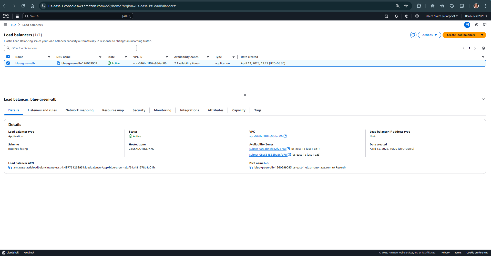
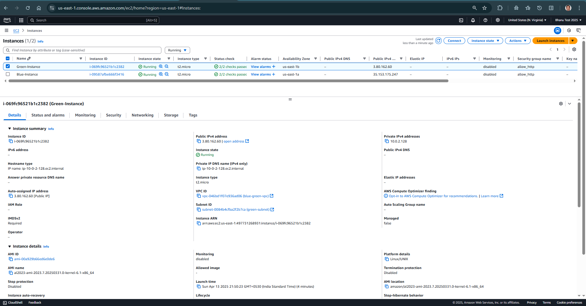

# Terraform Project
This repository contains terraform code to create the modules & resources in AWS cloud platform, to demonstrate Blue-Green deployments using Application Load Balancer.

## Network Module
The network module creates the following resources.
* VPC
* Subnets - 2 subnets for two availability zones
* Intenet gateway
* Route table & associate resources
* Security group allowing HTTP access

## Instance Module
The instance modules creates two ec2 instances with user data.

## Load Balancer Module
The load balancer module creates a load balancer with two target groups.

## Main Module
The main module actually calls the above child modules to create network, ec2 and load balancer resources.

## Verification
1. Two EC2 instances are created in a VPC, in us-east-1 region

2. One load balancer is created, and targeted to Blue target group i.e. Blue EC2 instance

3. Access load balancer DNS name - displaying Blue deployment

4. Update load balancer definition to Green targer group and apply terraform changes

5. Access load balancer DNS name - displaying Green deployment

6. Read Terraform state file and lock file, attached here for more details
